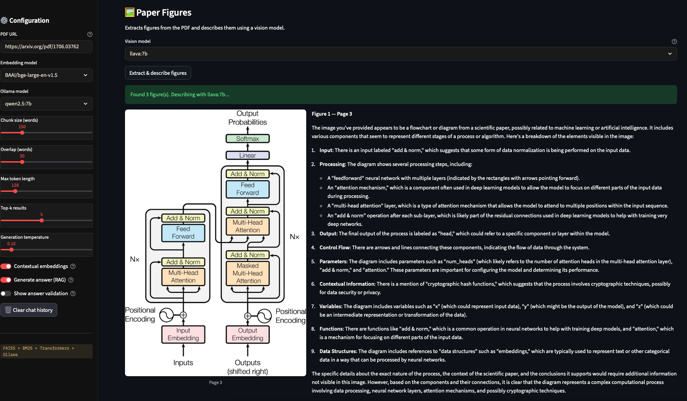

# 🔍 PaperSearch — Semantic Search & RAG Pipeline

A hybrid semantic search and question-answering system for research papers, combining dense vector retrieval (FAISS), lexical search (BM25), contextual embeddings, and local LLMs via Ollama.

There are three (good) candidates:

- ResNet: https://arxiv.org/pdf/1512.03385
- Attention is All You Need: https://arxiv.org/pdf/1706.03762
- BERT: https://arxiv.org/pdf/1810.04805




---

## Architecture

```mermaid
flowchart TD
    subgraph CURRENT["❌ Current Pipeline"]
        A1[PDF] --> B1[Chunks]
        B1 --> C1[BGE Embeddings]
        C1 --> D1[FAISS Index]
        D1 --> E1[Top-k Chunks]
        E1 --> F1[Qwen Generation]
        F1 --> G1[Answer]
    end

    subgraph IMPROVED["✅ Improved Pipeline"]
        A2[PDF] --> B2[Chunks]
        B2 --> C2[Qwen Contextualizer]
        C2 --> D2[Contextual Chunks]
        D2 --> E2[BGE Embeddings]
        D2 --> F2[BM25 Index]
        E2 --> G2[FAISS Search]
        F2 --> H2[BM25 Search]
        G2 --> I2[Rank Fusion]
        H2 --> I2
        I2 --> J2[Top-k Chunks]
        J2 --> K2[Qwen Generation]
        K2 --> L2[Answer]
    end

    style CURRENT fill:#1a1a2e,stroke:#e94560,color:#fff
    style IMPROVED fill:#1a1a2e,stroke:#0f3460,color:#fff
    style C2 fill:#e94560,color:#fff
    style F2 fill:#0f3460,color:#fff
    style I2 fill:#533483,color:#fff
```



---

## Key Features

- **Hybrid Retrieval** — FAISS semantic search + BM25 lexical search fused via Reciprocal Rank Fusion
- **Contextual Embeddings** — each chunk is enriched with an LLM-generated context sentence before embedding ([Anthropic Contextual Retrieval](https://www.anthropic.com/engineering/contextual-retrieval))
- **Multi-turn Q&A** — conversational interface with history capping to avoid context dilution
- **Answer Validation** — optional second LLM pass scoring faithfulness, completeness, and clarity
- **Figure Analysis** — extracts and describes figures using a vision model (llava:7b)
- **Hydra Config** — all parameters managed via YAML, supports CLI overrides and multirun sweeps
- **Systematic Benchmarking** — auto-generated and manual Q&A benchmarks with retrieval hit, faithfulness, completeness, clarity, and consistency metrics
- **Preference Data Collection** — saves chosen/rejected answer pairs for future DPO training

---

## Benchmarking Results (XGBoost paper)

Best configuration found via systematic evaluation (`top_k=5`, `temperature=0.0`) (experiments performed on a laptop)

---

## File Structure

```
semantic_search/
├── app.py                    # Streamlit web interface
├── main.py                   # CLI entry point
├── paper_search_engine.py    # core RAG engine
├── benchmark.py              # evaluation runner
├── conf/
│   ├── config.yaml           # main Hydra config
│   ├── model/
│   │   ├── default.yaml      # BAAI/bge-large-en-v1.5 + qwen2.5:7b
│   │   └── fast.yaml         # BGE-small + qwen2.5:3b
│   ├── retrieval/
│   │   └── default.yaml      # chunk_size=150, top_k=5, overlap=30
│   └── generation/
│       └── default.yaml      # temperature=0.0, prompts
├── benchmarks/
│   └── xgboost_benchmark.yaml  # manual Q&A pairs for evaluation
├── benchmark_results/        # timestamped JSON results per run
├── preference_data/
│   └── preferences.jsonl     # chosen/rejected pairs for DPO
├── tests/
│   └── test_paper_search_engine.py
└── app_style/
    └── styles.css
```

---

## Step-by-step Process

1. **PDF Processing** — PDF URL → downloaded locally → split into overlapping word chunks with page references
2. **Contextualisation** — each chunk enriched with a Qwen-generated situating sentence (optional, toggleable)
3. **Embedding** — chunks embedded via `BAAI/bge-large-en-v1.5` (CLS token, L2-normalised)
4. **Indexing** — vectors stored in FAISS `IndexFlatIP`; text stored in BM25Okapi
5. **Query Processing** — user question embedded with the same model
6. **Hybrid Retrieval** — FAISS top-k + BM25 top-k merged via Reciprocal Rank Fusion
7. **Generation** — retrieved chunks + query + history → `qwen2.5:7b`
8. **Validation** (optional) — generated answer → validator LLM → structured quality score

---

## Setup

### 1. Install uv (if missing)
```bash
curl -LsSf https://astral.sh/uv/install.sh | sh
```

### 2. Install dependencies
```bash
uv sync
```

### 3. Install Ollama
```bash
curl -fsSL https://ollama.com/install.sh | sh
```

### 4. Pull models
```bash
ollama pull qwen2.5:7b
ollama pull llama3.2:3b
ollama pull llava:7b        # optional, for figure analysis
```

### 5. Start Ollama server
```bash
ollama serve
```

---

## Usage

### Web interface
```bash
TOKENIZERS_PARALLELISM=false streamlit run app.py
```

### CLI
```bash
TOKENIZERS_PARALLELISM=false python main.py
```

### Run benchmark
```bash
# default config
TOKENIZERS_PARALLELISM=false python benchmark.py

# override parameters
TOKENIZERS_PARALLELISM=false python benchmark.py retrieval.top_k=5 generation.temperature=0.0

# multirun sweep
TOKENIZERS_PARALLELISM=false python benchmark.py --multirun \
  retrieval.top_k=3,5,7 \
  generation.temperature=0.0,0.1
```

---

## Configuration

All parameters are managed via Hydra YAML files in `conf/`. Key settings:

| Parameter | Default | Description |
|-----------|---------|-------------|
| `retrieval.chunk_size` | 150 | Words per chunk |
| `retrieval.overlap` | 30 | Overlap between chunks |
| `retrieval.top_k` | 5 | Chunks retrieved per query |
| `retrieval.use_contextual` | true | Contextual embeddings |
| `generation.temperature` | 0.0 | LLM temperature |
| `model.embedding` | BAAI/bge-large-en-v1.5 | Embedding model |
| `model.ollama` | qwen2.5:7b | Generation model |
| `model.validator` | llama3.2:3b | Validation model |

---

## Requirements

- Python 3.12+
- 12GB RAM recommended (8GB minimum without contextual embeddings)
- macOS (Apple Silicon supported), Linux, or Windows
- Ollama installed and running

---

## Acknowledgements

- [Anthropic Contextual Retrieval](https://www.anthropic.com/engineering/contextual-retrieval)
- [Meta FAISS](https://github.com/facebookresearch/faiss)
- [Hugging Face Transformers](https://huggingface.co/transformers)
- [Ollama](https://ollama.com)
- [Streamlit](https://streamlit.io)
- [rank_bm25](https://github.com/dorianbrown/rank_bm25)
- [Hydra](https://hydra.cc)
- [Claude AI](https://claude.ai)

---

## License

This project is licensed under the MIT License — see the LICENSE file for details.