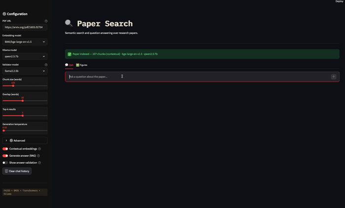

# 🔍 PaperSearch — Semantic Search & RAG Pipeline

A hybrid semantic search and question-answering system for research papers, combining dense vector retrieval (FAISS), lexical search (BM25), contextual embeddings, and local LLMs via Ollama — with systematic benchmarking and preference data collection for future DPO training.

[](https://opensource.org/licenses/MIT) [](https://www.python.org/) [](https://streamlit.io) [](https://ollama.com) [](https://github.com/facebookresearch/faiss) [](https://github.com/dorianbrown/rank_bm25) [](https://hydra.cc) [](https://huggingface.co/transformers)



---

## Architecture

```
PDF → Chunks → [Qwen Contextualizer] → BGE Embeddings → FAISS ──┐
                                     → BM25 Index    ────────────┤→ Rank Fusion → Top-k → Qwen Answer → Validator Score
                                                                  └──────────────────────────────────────────────────────
```

The improved pipeline (toggled via `use_contextual`) enriches each chunk with an LLM-generated situating sentence before embedding, following [Anthropic's Contextual Retrieval](https://www.anthropic.com/engineering/contextual-retrieval).

---

## Key Features

- **Hybrid Retrieval** — FAISS semantic search + BM25 lexical search fused via Reciprocal Rank Fusion
- **Contextual Embeddings** — each chunk enriched with an LLM-generated context sentence before embedding
- **Multi-turn Q&A** — conversational interface with history
- **Answer Validation** — optional second LLM pass scoring faithfulness, completeness, and clarity
- **Figure Analysis** — extracts and describes figures from the PDF using a local vision model; structured prompt reduces hallucinations (cloud vision API recommended for best results);
- **Hydra Config** — all parameters managed via YAML with CLI overrides and multirun sweeps
- **Systematic Benchmarking** — auto-generated Q&A benchmarks with retrieval hit, faithfulness, completeness, clarity, and consistency metrics
---

## Benchmark Results

Evaluated on the **XGBoost paper** ([arXiv:1603.02754](https://arxiv.org/pdf/1603.02754)) using **11 human-like Q&A pairs** with verified answers and relevant page numbers. Best configuration selected from multiple runs sweeping `chunk size, overlap, top_k, and temperature`. (for more info [`benchmark_results/`](./benchmark_results/).)

| Metric | Score |
|---|---|
| Retrieval Hit Rate | **0.68** |
| Faithfulness | **3.73 / 5** |
| Completeness | **3.68 / 5** |
| Clarity | **4.05 / 5** |
| Consistency | **1.00** |


**Best configuration:** `BAAI/bge-large-en-v1.5` · `qwen2.5:7b` · `chunk_size=150` · `overlap=50` · `top_k=5` · `temperature=0.0` · `use_contextual=true`

---

## Limitations

- **Completeness on detail-heavy questions** — when the ground truth spans multiple chunks (e.g. hardware specs, full algorithm definitions), a single top-k retrieval may miss parts of the answer
- **Auto-generated ground truth** — rapid evaluation on new papers uses LLM-generated Q&A pairs, not human-annotated. The **XGBoost benchmark** uses some human-reviewed pairs; results on other papers should be interpreted as indicative only 
- **Figure analysis quality** — local vision models (llava variants) struggle with scientific diagrams containing mathematical notation; even after some prompt tweaks
---

## File Structure

```
paper-search/
├── app.py                      # Streamlit web interface
├── main.py                     # CLI entry point
├── paper_search_engine.py      # core RAG engine
├── Benchmark.py                # evaluation runner
├── conf/
│   ├── config.yaml             # main Hydra config
│   ├── model/
│   │   ├── default.yaml        # BAAI/bge-large-en-v1.5 + qwen2.5:7b
│   │   └── fast.yaml           # BGE-small + qwen2.5:3b
│   ├── retrieval/
│   │   └── default.yaml        # chunk_size=150, top_k=3, overlap=30
│   └── generation/
│       └── default.yaml        # temperature=0.1, prompts
├── benchmarks/
│   └── *.yaml                  # Q&A pairs for evaluation
├── benchmark_results/          # timestamped JSON results per run
├── preference_data/
│   └── preferences.jsonl       # chosen/rejected pairs for DPO
└── app_style/
    └── styles.css
```

---

## Step-by-step Process

1. **PDF Processing** — PDF URL → streamed directly into memory (no local download) → split into overlapping word chunks with page references
2. **Contextualisation** — each chunk enriched with a Qwen-generated situating sentence (optional, toggleable)
3. **Embedding** — chunks embedded via `BAAI/bge-large-en-v1.5` (mean pooling, L2-normalised)
4. **Indexing** — vectors stored in FAISS `IndexFlatIP`; text stored in BM25Okapi
5. **Query Processing** — user question embedded with the same model
6. **Hybrid Retrieval** — FAISS top-k + BM25 top-k merged via Reciprocal Rank Fusion
7. **Generation** — retrieved chunks + query + conversation history → `qwen2.5:7b`
8. **Validation** (optional) — generated answer → validator LLM → structured faithfulness/completeness/clarity score

---

## Setup

### 1. Install uv

```bash
curl -LsSf https://astral.sh/uv/install.sh | sh
```

### 2. Install dependencies

```bash
uv sync
```

### 3. Install Ollama

```bash
curl -fsSL https://ollama.com/install.sh | sh
```

### 4. Pull models

```bash
ollama pull qwen2.5:7b
ollama pull llama3.2:3b
ollama pull llava-llama3    # optional, for figure analysis
```

### 5. Start Ollama server

```bash
ollama serve
```

---

## Usage

### Web interface

```bash
TOKENIZERS_PARALLELISM=false streamlit run app.py
```

### CLI

```bash
TOKENIZERS_PARALLELISM=false python main.py
```

### Run benchmark

```bash
# default config
TOKENIZERS_PARALLELISM=false python Benchmark.py

# override parameters
TOKENIZERS_PARALLELISM=false python Benchmark.py retrieval.top_k=5 generation.temperature=0.0

# multirun sweep
TOKENIZERS_PARALLELISM=false python Benchmark.py --multirun \
  retrieval.top_k=3,5,7 \
  generation.temperature=0.0,0.1
```

---

## Configuration

All parameters managed via Hydra YAML files in `conf/`. 

Good candidate papers to try:

- ResNet: https://arxiv.org/pdf/1512.03385
- Attention Is All You Need: https://arxiv.org/pdf/1706.03762
- BERT: https://arxiv.org/pdf/1810.04805

---


## Acknowledgements

- [Anthropic Contextual Retrieval](https://www.anthropic.com/engineering/contextual-retrieval)
- [Meta FAISS](https://github.com/facebookresearch/faiss)
- [Hugging Face Transformers](https://huggingface.co/transformers)
- [Ollama](https://ollama.com)
- [Streamlit](https://streamlit.io)
- [rank_bm25](https://github.com/dorianbrown/rank_bm25)
- [Hydra](https://hydra.cc)
- [Claude AI](https://claude.ai)

---

## License

MIT License — see [LICENSE](./LICENSE) for details.